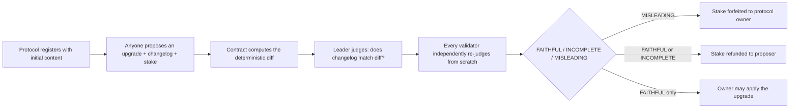

# UpgradeChangelogGate

A reusable GenLayer Intelligent Contract primitive that verifies a proposed upgrade's changelog is a **faithful** account of what actually changed before a protocol's version pointer is allowed to move. GenLayer's independent validator consensus never decides whether an upgrade is a *good* idea -- only whether the prose explaining it is *honest* about a deterministic, contract-computed diff. That narrower, checkable question is what the whole design is built around.

## Deployed contract

**Network:** GenLayer Bradbury Testnet

**Contract:** _to be filled in after deployment -- see [CHANGELOG.md](CHANGELOG.md) for the current live address once deployed._

## The trust problem

Every upgradeable protocol -- a DAO, a multisig-controlled config, a versioned parameter set -- faces the same governance gap: a proposer writes a changelog, and everyone downstream (voters, delegates, users) has to trust that the prose actually describes what changed. A proposer who wants to slip in an undisclosed change -- a quietly-modified admin address bundled behind an innocuous "adjusted fee parameters" changelog -- only has to write past a human skim. No single reviewer's sign-off is a real guarantee, and asking one centralized party to "just check carefully every time" is exactly the trust bottleneck a decentralized protocol is supposed to avoid.

**Not the pattern this category filters out.** This is not a thin LLM wrapper: the diff that grounds every judgment is computed deterministically, in plain Python, before any model is involved -- the model never gets to invent what changed, only to read prose against a fact the contract itself already established. Not a format-only validator: `validator_fn` never inspects the leader's claimed verdict for shape -- it re-runs the identical judgment from scratch against the identical, already-agreed diff, and only agrees if it independently lands on the same bucket. Not a generic "AI decides X" demo: GenLayer's role is narrowly "is this changelog honest," never "is this upgrade wise" -- that stays a human governance decision, made with an honest account of the facts instead of an unverified one.

## What it does



1. A protocol registers itself with `register_protocol`: a `protocol_id`, its starting `content` (a flat JSON object -- fee parameters, admin addresses, feature flags, a hash of an off-chain artifact, anything JSON-scalar-valued), and a minimum GEN stake required to propose against it.
2. **Anyone** -- not just the owner -- may `propose_upgrade`: new content, a prose changelog, and a stake meeting the minimum. This is deliberately open: the whole point is an objective check that only has teeth if proposing isn't limited to a party who'd only ever have to convince themselves.
3. The contract computes the actual field-by-field diff between old and new content -- deterministically, the same on every node, no model or network fetch involved.
4. `evaluate_proposal` is the one non-deterministic step: the leader judges whether the changelog is a faithful account of that diff, forced into exactly one of three buckets. Every validator independently re-runs the identical judgment against the identical diff and changelog -- never trusts the leader's claim -- and only agreement counts.
5. A `MISLEADING` verdict forfeits the proposer's stake to the protocol owner. `FAITHFUL` or `INCOMPLETE` refunds it. Only `FAITHFUL` lets the owner later call `accept_proposal` to actually flip the content pointer -- separating "is this changelog honest" (GenLayer's job) from "do we want this change" (the owner's own call, always).

## Why GenLayer is required

A deterministic contract can diff two JSON blobs perfectly -- that part needs no AI at all, and this contract does it in plain code. What it cannot do is read whether the *prose* describing that diff is honest: "increased fee_bps from 30 to 50" is either an accurate, complete account or it isn't, and that's a language-understanding judgment with no formula. A single off-chain reviewer (human or a centralized LLM call) is exactly the trust bottleneck this is meant to remove -- whoever controls that reviewer controls whether dishonest changelogs get caught. GenLayer's Equivalence Principle is what lets many independent validators reach binding, non-gameable consensus on that judgment instead.

## Screened against the six gates that appear to actually drive Portal scoring

Cross-referencing this design against a decision framework used by an independently accepted GenLayer Portal submission (`spec-compliance-bounty`'s own `docs/DECISION_RECORD.md`), not just this account's own checklist:

| Gate | How this contract passes it |
|---|---|
| **A -- counterfactual** | Delete GenLayer: a single arbiter has to be trusted to "just check carefully" whether a changelog is honest. With GenLayer, the check is reproducible by anyone and decided by independent validators, not whoever controls a review process. |
| **B -- trust problem** | The proposer wants their upgrade applied; the protocol's stakeholders want no undisclosed changes. Neither should unilaterally decide "is this changelog honest." |
| **C -- is it a judgment?** | The verdict is never reducible to a stored expected value -- there is no `expected_changelog` anywhere in storage, only a diff (fact) and a changelog (claim), and the question "does the claim honestly describe the fact" is genuine semantic reading, not string equality. |
| **D -- would someone import it?** | Any upgradeable DAO/protocol/multisig with a versioned content pointer is a direct integration target -- see [`examples/integration.md`](examples/integration.md) for the concrete call sequence. |
| **E -- consequential?** | Directly gates two real actions: GEN stake routing (forfeiture vs. refund) and whether a protocol's actual content pointer can move at all. |
| **F -- originality** | Distinct in mechanism from this account's own prior primitives (evidence-vs-criteria settlement, capital markets, policy evaluation) and from every repo benchmarked while designing this one -- see [`docs/DESIGN.md`](docs/DESIGN.md#originality) for the explicit comparison. |

## Contract interface

```python
@gl.public.write
def register_protocol(self, protocol_id: str, initial_content: str, min_proposal_stake: u256) -> None

@gl.public.write.payable
def propose_upgrade(self, protocol_id: str, new_content: str, changelog: str) -> str
    # returns proposal_id. Permissionless -- anyone may propose against any registered protocol.

@gl.public.write
def evaluate_proposal(self, proposal_id: str) -> str
    # returns the agreed verdict. The one non-deterministic call in the contract.

@gl.public.write
def accept_proposal(self, proposal_id: str) -> None
    # owner-only; requires a stored FAITHFUL verdict; flips the content pointer.

@gl.public.write
def update_stake_requirement(self, protocol_id: str, new_min_stake: u256) -> None
    # owner-only.

@gl.public.view
def get_protocol(self, protocol_id: str) -> str

@gl.public.view
def get_proposal(self, proposal_id: str) -> str

@gl.public.view
def get_latest_proposal_for_protocol(self, protocol_id: str) -> str

@gl.public.view
def get_proposal_count(self) -> u256
```

## Proposal record schema

`get_proposal` returns a JSON string decoding to:

```json
{
  "proposal_id": "proposal-0",
  "protocol_id": "demo-protocol",
  "proposer": "0x...",
  "new_content": {"fee_bps": "50", "admin": "0xOldAdminAddress"},
  "changelog": "Increased fee_bps from 30 to 50 to fund development.",
  "diff": [
    {"field": "fee_bps", "change": "modified", "old_value": "30", "new_value": "50"}
  ],
  "flagged": false,
  "stake": "100",
  "status": "evaluated",
  "verdict": "FAITHFUL",
  "reason": "The changelog accurately describes the only field that changed.",
  "submitted_at": "2026-08-20T00:00:00Z",
  "evaluated_at": "2026-08-20T00:05:00Z",
  "applied": true,
  "applied_at": "2026-08-20T00:10:00Z"
}
```

`flagged` is a heuristic transparency signal for changelog text that matches common prompt-injection phrasing -- never a rejection gate, and `flagged: false` is not proof the changelog was honest, only that it didn't use an obvious pattern. `get_protocol`/`get_proposal` both return JSON-encoded strings, never a `dict`, so no return value can ever carry an un-encodable float.

## Integration

`propose_upgrade`/`evaluate_proposal`/`accept_proposal` are all writes and must be called directly by an externally-owned account or a real user-signed transaction -- not as a cross-contract call from another Intelligent Contract's write path, since cross-contract *write* calls are known to silently no-op on the current GenLayer Bradbury build. A consuming DAO/protocol should read this contract's state via `.view()` (reliable on Bradbury) after a human or keeper transaction has driven the propose → evaluate → accept flow directly. See [`examples/integration.md`](examples/integration.md).

## Testing

42 direct-mode tests in [`tests/direct/test_upgrade_changelog_gate.py`](tests/direct/test_upgrade_changelog_gate.py), covering the full register → propose → evaluate → accept lifecycle, the signature adversarial scenario (an honest fee-change changelog vs. one that silently omits an admin-address change judged `MISLEADING`), stake routing on all three verdicts, ownership/authorization on every owner-gated method, permissionless proposal and evaluation, re-evaluation and double-apply guards, full input validation, deterministic diff computation (added/removed/modified), the manipulation-heuristic screen, verdict fail-closed coercion, and **validator independence** -- direct tests proving `validator_fn` genuinely re-derives its own verdict and rejects a leader's mismatched claim while ignoring reason-text differences.

```bash
gltest tests/direct/ -v
genvm-lint check contracts/UpgradeChangelogGate.py
genvm-lint typecheck contracts/UpgradeChangelogGate.py
```

All three pass clean: 42/42 tests, zero lint warnings, zero type errors. [`.github/workflows/ci.yml`](.github/workflows/ci.yml) runs all three on every push and pull request.

## License

MIT -- see [LICENSE](LICENSE).
